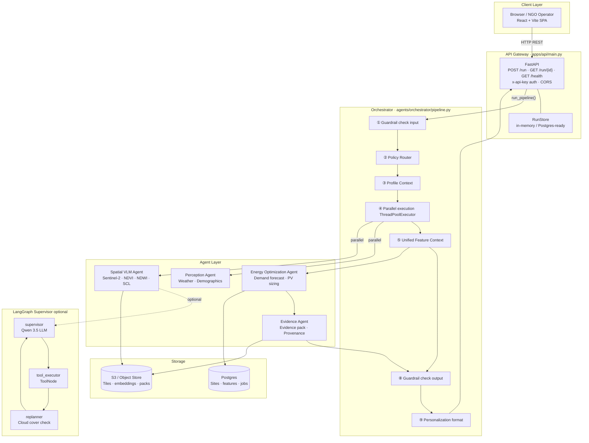
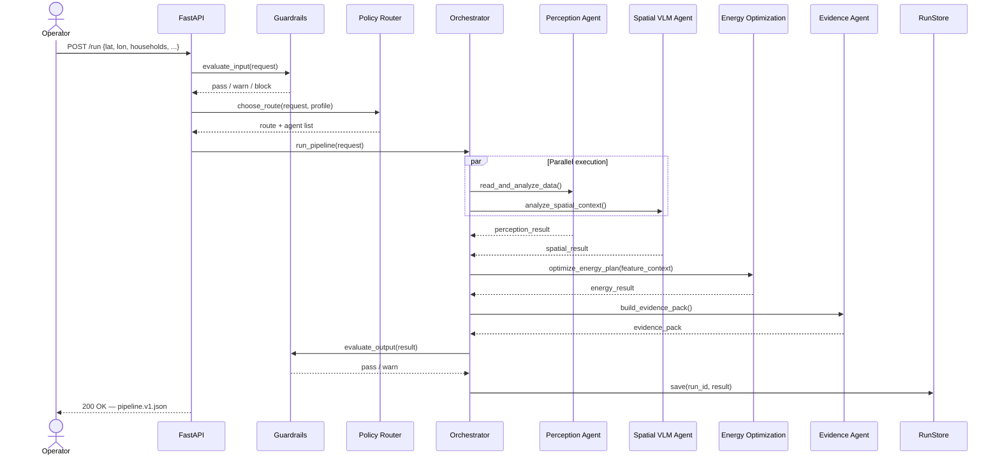
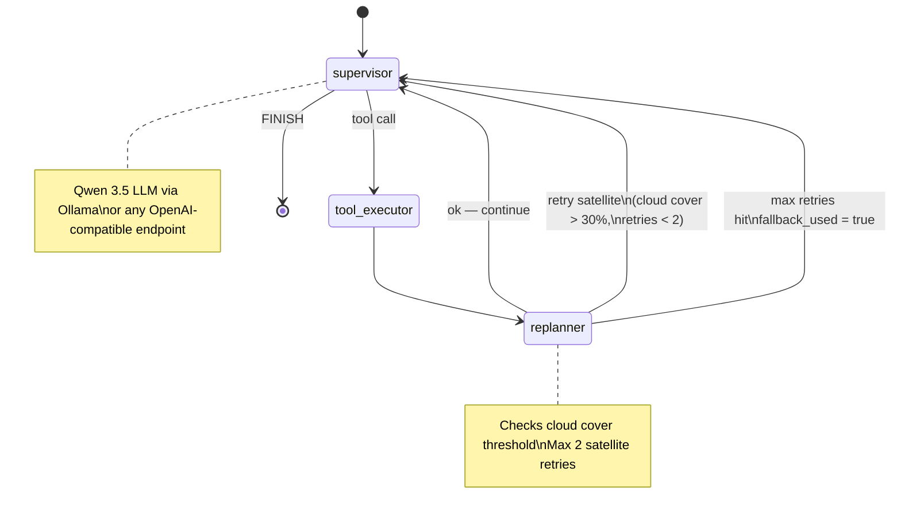

# Solaris — System Architecture

> Multi-agent decision-support system for forecasting off-grid energy demand and recommending solar/battery sizing for unelectrified communities.

---

## Table of Contents

1. [High-Level Overview](#1-high-level-overview)
2. [System Diagram](#2-system-diagram)
3. [Layer Breakdown](#3-layer-breakdown)
   - [Frontend](#31-frontend)
   - [API Gateway](#32-api-gateway)
   - [Orchestrator](#33-orchestrator)
   - [Agent Layer](#34-agent-layer)
   - [LangGraph Supervisor](#35-langgraph-supervisor)
   - [Shared Modules](#36-shared-modules)
   - [Storage](#37-storage)
4. [Agent Descriptions](#4-agent-descriptions)
5. [Request Lifecycle](#5-request-lifecycle)
6. [Pipeline Contract](#6-pipeline-contract)
7. [Policy Router](#7-policy-router)
8. [Guardrails & Personalization](#8-guardrails--personalization)
9. [LangGraph Supervisor Graph](#9-langgraph-supervisor-graph)
10. [Config & Environment](#10-config--environment)
11. [Key Design Decisions](#11-key-design-decisions)
12. [Directory Map](#12-directory-map)

---

## 1. High-Level Overview

Solaris accepts a village location (`lat/lon`, households, usage profile) and produces:

- **30-day + seasonal demand forecast** (kWh/day with confidence bands)
- **PV kW + battery kWh + kit count** recommendation
- **Impact metrics** (CO₂ avoided, cost savings, households served)
- **Evidence pack** for audit, provenance, and reporting

The current execution mode is **VLM-first + deterministic optimizer**. Neural-network training/inference is deferred to a post-hackathon iteration.

---

## 2. System Diagram



---

## 3. Layer Breakdown

### 3.1 Frontend

| Item | Detail |
|------|--------|
| Framework | React 18 + Vite + TypeScript |
| Styling | Tailwind CSS |
| Routing | React Router v6 |
| Entry point | `apps/frontend/src/main.tsx` |
| Pages | `Dashboard`, `Studio`, `LocationDetail` |
| Build | `npm run build` → static assets |

The frontend communicates with the API via standard HTTP REST calls. No WebSocket or streaming is used in the current MVP.

### 3.2 API Gateway

**File:** `apps/api/main.py`

| Endpoint | Method | Description |
|----------|--------|-------------|
| `/run` | POST | Submit a new pipeline run |
| `/run/{id}` | GET | Retrieve a completed run result |
| `/run/{id}/quality` | GET | Quality/confidence summary for a run |
| `/health` | GET | Liveness probe |

- Built with **FastAPI** (async lifespan, CORS middleware).
- Optional bearer auth via `SOLARIS_API_TOKEN` env var (`x-api-key` header).
- `RunStore` (`apps/api/store.py`) manages in-memory result storage with a Postgres upgrade path.

**RunRequest schema:**
```json
{
  "request_id": "string",
  "lat": float,
  "lon": float,
  "horizon_days": 30,
  "households": int | null,
  "usage_profile": "string | null"
}
```

### 3.3 Orchestrator

**File:** `agents/orchestrator/pipeline.py`

The orchestrator is the central coordinator. It is a deterministic Python function (`run_pipeline`) that:

1. **Validates input** with the guardrails module.
2. **Routes the request** via the Policy Router to select an agent sequence.
3. **Loads the operator profile** context (`config/profile_context.json`).
4. **Runs Perception and Spatial VLM in parallel** using `ThreadPoolExecutor` (max 2 workers).
5. **Merges** the two results into a unified feature context.
6. **Runs Energy Optimization** on the merged context.
7. **Builds the Evidence Pack** via the Evidence Agent.
8. **Validates the output** with guardrails.
9. **Applies personalization** formatting to the recommendation.
10. Returns a fully structured pipeline result conforming to `pipeline.v1.json`.

On any agent failure the orchestrator inserts a degraded payload with `fallback_used=true` and continues — the system is designed for graceful degradation.

### 3.4 Agent Layer

Five purpose-built agents each own a narrow responsibility:

| Agent | Path | Responsibility |
|-------|------|----------------|
| Perception | `agents/perception/agent.py` | Weather data, demographic baselines, usage patterns |
| Spatial VLM | `agents/spatial_vlm/agent.py` | Sentinel-2 satellite imagery: NDVI, NDWI, SCL, change detection |
| Energy Optimization | `agents/energy_optimization/agent.py` | Demand forecast, PV/battery sizing, scenario portfolio |
| Evidence | `agents/evidence/agent.py` | Evidence pack assembly, provenance tracking, audit trail |
| Data | `agents/data/agent.py` | Generic data retrieval utilities |

Each agent is a **pure Python function** with no shared mutable state, making them independently testable and parallelisable.

### 3.5 LangGraph Supervisor

**Path:** `agents/langgraph/`

An optional LLM-driven execution layer on top of the deterministic pipeline:

| Node | Role |
|------|------|
| `supervisor` | LLM (Qwen 3.5) inspects state, decides which tool to call next |
| `tool_executor` | `ToolNode` executes the selected tool and stores result |
| `replanner` | Checks quality (cloud cover threshold) and triggers re-fetch if needed |

- LLM is accessed through an OpenAI-compatible endpoint (default: **Ollama** at `localhost:11434`).
- Configurable via `SOLARIS_LLM_MODEL`, `SOLARIS_LLM_BASE_URL`, `SOLARIS_LLM_API_KEY`.
- Maximum of 2 satellite retries before falling back.
- State flows through `AgentState` TypedDict (messages, perception/spatial/energy/evidence results, plan, errors).

**Files:**
- `agents/langgraph/graph.py` — graph definition and compilation
- `agents/langgraph/state.py` — state schema
- `agents/langgraph/tools.py` — tool definitions bound to LLM
- `agents/langgraph/prompts.py` — supervisor system prompt

### 3.6 Shared Modules

| Module | Path | Purpose |
|--------|------|---------|
| Guardrails | `shared/guardrails.py` | Input + output validation, block/warn/pass logic |
| Personalization | `shared/personalization.py` | Recommendation text formatting per operator profile |
| Profile Context | `shared/profile_context.py` | Loads `config/profile_context.json` |
| Agent Profiles | `shared/agent_profiles.py` | Per-agent guardrails and persona config |
| HTTP Cache | `shared/http_cache.py` | Cached `fetch_json` / `fetch_bytes` for external APIs |
| Validation | `shared/validation.py` | JSON-schema validation against `pipeline.v1.json` |

### 3.7 Storage

| Store | Technology | Used for |
|-------|-----------|----------|
| Run results | In-memory dict (`RunStore`) | MVP; Postgres upgrade path exists |
| DB schema | `db/schema.sql` | Sites, inputs, features, job states (Postgres) |
| Object store | S3/compatible (referenced in docs) | Compressed tiles, embeddings, evidence packs |

---

## 4. Agent Descriptions

### Perception Agent

- Fetches **weather data** for the given lat/lon (solar irradiance, temperature, cloud cover).
- Estimates **demographic baselines** (household count, usage patterns).
- Outputs a structured `perception` dict consumed by the Energy Optimization agent.

### Spatial VLM Agent

- Queries **Microsoft Planetary Computer** for Sentinel-2 L2A imagery.
- Computes:
  - **NDVI** (vegetation health index)
  - **NDWI** (water extent index)
  - **SCL** (Scene Classification Layer — cloud/shadow/usable pixel ratio)
  - **ΔNDVI** change detection (90-day comparison)
- Emits `feature_summaries` and a true-color preview URL.
- Falls back gracefully if imagery is unavailable (`fallback_used=true`, reduced confidence).

### Energy Optimization Agent

- Takes the merged feature context (perception + spatial).
- Runs a **deterministic sizing algorithm**:
  - Peak sun hours estimation
  - PV derating factor applied
  - Battery autonomy + depth-of-discharge calculation
  - Kit count from kWh/day per kit
- Produces `demand_forecast`, `scenario_set` (primary scenario), `optimization_result`, and `impact_metrics` (CO₂ avoided, cost savings, households served).
- Configurable via `profile.json` and environment variables (`SOLARIS_PV_DERATE`, etc.).

### Evidence Agent

- Assembles the **Evidence Pack**: rationale, assumptions, provenance sources, quality flags.
- Records data lineage (weather source, demographics source, imagery provider).
- Output is included in every API response for transparency and auditing.

---

## 5. Request Lifecycle



---

## 6. Pipeline Contract

All inter-agent data and API responses conform to **`shared/schemas/pipeline.v1.json`** (JSON Schema draft 2020-12).

Top-level required fields:

| Field | Type | Description |
|-------|------|-------------|
| `run_id` | string | Unique run identifier (UUID) |
| `request` | object | Original input (lat, lon, horizon_days, …) |
| `outputs` | object | All agent results (see below) |
| `evidence_pack` | object | Provenance + audit trail |

`outputs` required fields:

| Field | Description |
|-------|-------------|
| `feature_context` | Status, confidence, assumptions, quality flags |
| `demand_forecast` | `kwh_per_day`, `lower_ci`, `upper_ci` |
| `scenario_set` | Primary scenario: `pv_kw`, `battery_kwh`, `solar_kits` |
| `optimization_result` | Priority score, efficiency gain, top plan ID |
| `impact_metrics` | CO₂, cost savings, households served, confidence band |
| `provenance` | Data source attribution |
| `quality` | Overall quality status and fallback flag |

Optional runtime trace fields: `outputs.policy`, `outputs.profile`, `outputs.guardrail`, `outputs.recommendation`.

---

## 7. Policy Router

**File:** `agents/router/policy.py` — `choose_route(request, profile) → route dict`

Routes control which agent sequence runs and with what priority:

| Route | Trigger | Description |
|-------|---------|-------------|
| `default_planning` | default | Standard off-grid planning (all 4 agents) |
| `productive_use_priority` | `usage_profile == "productive-use-heavy"` | Emphasises productive load sizing |
| `long_horizon_risk_aware` | `horizon_days > 90` | Extended forecast with risk overlay |
| `safety_prioritized` | profile `priority.mode == "safety"` | Conservative headroom for safety-critical sites |

All routes currently execute the same four agents (`perception → spatial_vlm → energy_optimization → evidence`). The route label is recorded in `outputs.policy` for traceability.

---

## 8. Guardrails & Personalization

### Guardrails (`shared/guardrails.py`)

Two checkpoints — input and output — each returning one of:

| Status | Meaning |
|--------|---------|
| `pass` | No issues |
| `warn` | Flagged but execution continues |
| `block` | Request rejected; blocked response returned immediately |

Input checks: lat/lon bounds, household count sanity, usage profile whitelist.  
Output checks: confidence threshold, non-negative physical values, schema compliance.

Controlled via feature flag `GUARDRAILS_STRICT_MODE`.

### Personalization (`shared/personalization.py`)

- Formats the `recommendation` field in the API response according to the operator's profile (`config/profile_context.json`).
- Profiles encode priorities (safety, cost, growth), preferred units, and persona.
- Enabled/disabled via `PERSONALIZATION_ENABLED`.

---

## 9. LangGraph Supervisor Graph



---

## 10. Config & Environment

| Variable | Default | Purpose |
|----------|---------|---------|
| `SOLARIS_API_TOKEN` | _(unset)_ | Enables `x-api-key` auth on `/run` |
| `SOLARIS_LLM_MODEL` | `qwen3.5` | LangGraph LLM model name |
| `SOLARIS_LLM_BASE_URL` | `http://localhost:11434/v1` | OpenAI-compatible LLM endpoint |
| `SOLARIS_LLM_API_KEY` | `ollama` | API key for LLM endpoint |
| `GUARDRAILS_STRICT_MODE` | `false` | Treat warnings as blocks |
| `POLICY_ROUTER_ENABLED` | `true` | Enable/disable policy routing |
| `PERSONALIZATION_ENABLED` | `true` | Enable/disable output personalization |
| `SOLARIS_PV_DERATE` | `0.8` | PV system derating factor |
| `SOLARIS_MIN_SUN_HOURS` | `2.5` | Minimum peak sun hours |
| `SOLARIS_MAX_SUN_HOURS` | `7.5` | Maximum peak sun hours |

Profile context: `config/profile_context.json`

---

## 11. Key Design Decisions

| Decision | Rationale |
|----------|-----------|
| **VLM-first, NN deferred** | Faster to MVP; satellite imagery + heuristic optimizer is already accurate for sizing decisions. NN added post-hackathon. |
| **Deterministic pipeline + optional LangGraph** | Deterministic core guarantees reproducibility and testability; LangGraph layer adds LLM-driven adaptability for complex edge cases. |
| **Parallel Perception + Spatial VLM** | Both agents are I/O-bound (external APIs). Running in parallel cuts wall-clock latency roughly in half. |
| **Graceful degradation** | Every agent failure produces a `degraded` payload rather than crashing the run. The pipeline always returns a usable (if low-confidence) result. |
| **Schema-first contract** | `pipeline.v1.json` is frozen before implementation. All agents and the API are validated against it. Breaking changes require a schema version bump. |
| **Stateless agents** | Agents are pure functions with no side effects, enabling parallel execution and isolated unit testing. |
| **In-memory RunStore now, Postgres later** | `db/schema.sql` is ready; swap `get_store()` in `apps/api/store.py` when persistence is needed. |

---

## 12. Directory Map

```
solaris-hackathon/
├── agents/
│   ├── orchestrator/pipeline.py     # Central coordinator
│   ├── perception/agent.py          # Weather + demographics
│   ├── spatial_vlm/agent.py         # Satellite imagery + VLM
│   ├── energy_optimization/
│   │   ├── agent.py                 # Sizing optimizer
│   │   └── impact.py                # Impact metrics computation
│   ├── evidence/agent.py            # Evidence pack builder
│   ├── router/policy.py             # Policy/route selection
│   ├── data/agent.py                # Data utilities
│   └── langgraph/                   # LangGraph supervisor graph
│       ├── graph.py
│       ├── state.py
│       ├── tools.py
│       └── prompts.py
├── apps/
│   ├── api/
│   │   ├── main.py                  # FastAPI app + endpoints
│   │   └── store.py                 # RunStore (in-memory)
│   └── frontend/                    # React + Vite SPA
│       └── src/
│           ├── pages/               # Dashboard, Studio, LocationDetail
│           └── components/          # UI components
├── shared/
│   ├── guardrails.py
│   ├── personalization.py
│   ├── profile_context.py
│   ├── agent_profiles.py
│   ├── http_cache.py
│   ├── validation.py
│   └── schemas/pipeline.v1.json     # Source-of-truth contract
├── config/
│   └── profile_context.json         # Operator profile / persona
├── db/
│   └── schema.sql                   # Postgres schema
├── tests/                           # Unit + smoke tests
├── scripts/                         # Automation + demo scripts
└── docs/                            # Supplementary documentation
```
