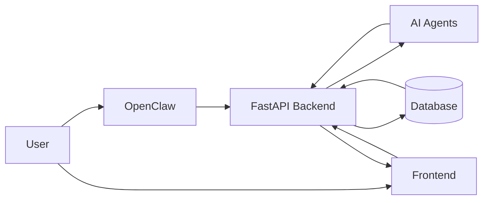

# Solaris System Architecture

## Demo Diagram

## Demo Flow

- User asks from OpenClaw or frontend.
- Backend runs agents and creates analysis output.
- Output is stored in database.
- Frontend reads and displays saved results.
