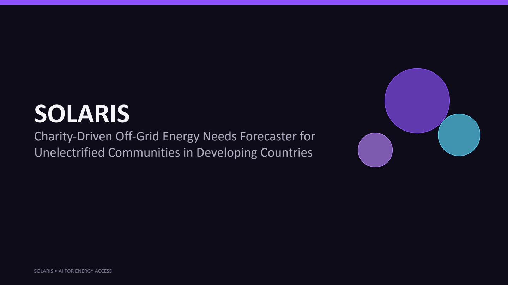
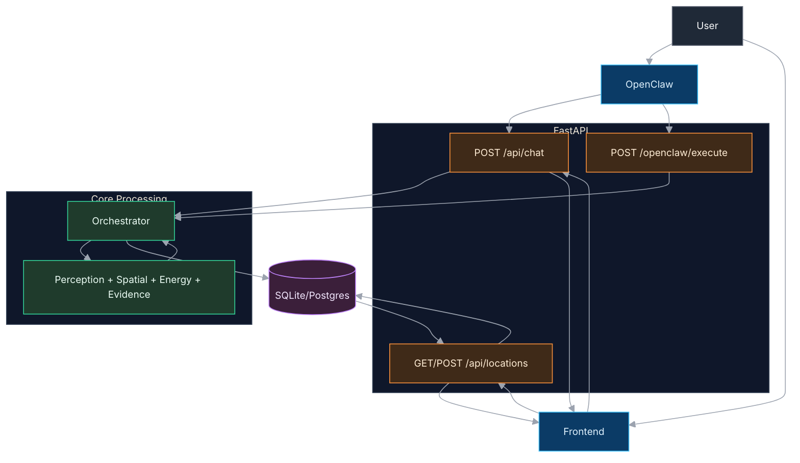

# Solaris Hackathon

Multi-agent decision-support system for forecasting off-grid energy demand and recommending deployable solar sizing for unelectrified communities.

## MVP Goal
Given a village (`lat/lon`, households, usage profile), produce:
- 30-day + seasonal demand forecast (kWh/day)
- Recommended PV kW + battery kWh + kit count
- Confidence band + assumptions
- Map-ready payload + concise report

> Current mode: **VLM-first + deterministic optimizer**. NN training/inference is deferred for post-hackathon iteration.

## Pitch Deck

GitHub README does not reliably inline PDF slides, so here are direct links:
- **View deck page:** [Solaris Pitch Deck Viewer](https://mara-241.github.io/solaris-hackathon/pitch/)
- **Open PDF directly:** [Solaris_Pitch_Deck.pdf](https://mara-241.github.io/solaris-hackathon/pitch/Solaris_Pitch_Deck.pdf)

### Slide Navigator (Compact)

Pick a slide:
1. [Slide 1](docs/pitch/slides/slide-01.png) · 2. [Slide 2](docs/pitch/slides/slide-02.png) · 3. [Slide 3](docs/pitch/slides/slide-03.png) · 4. [Slide 4](docs/pitch/slides/slide-04.png) · 5. [Slide 5](docs/pitch/slides/slide-05.png)
6. [Slide 6](docs/pitch/slides/slide-06.png) · 7. [Slide 7](docs/pitch/slides/slide-07.png) · 8. [Slide 8](docs/pitch/slides/slide-08.png) · 9. [Slide 9](docs/pitch/slides/slide-09.png) · 10. [Slide 10](docs/pitch/slides/slide-10.png)

<details>
  <summary>Preview (open/collapse)</summary>



</details>

## Overview



## Repository Structure
- `agents/` — orchestrator + perception + spatial_vlm + energy_optimization + evidence
- `shared/schemas/` — pipeline contracts (source of truth)
- `apps/api/` — API backend (core run endpoints + chat/location/satellite dashboard APIs)
- `db/` — SQL schema scaffold for Postgres
- `tests/` — unit + smoke tests
- `docs/` — architecture, operations, implementation plan

## Team Workflow
- Branch from `main` with short-lived feature branches
- PR required for merges
- Update schemas first when changing contracts

## First Task
Define and freeze `shared/schemas/pipeline.v1.json` before implementation starts.

## Workflow automation scripts
- `scripts/new_task.py` — create task from incoming request
- `scripts/check-agents.sh` — monitor task/check status and review readiness
- `scripts/authorize_push.py` — record explicit human push authorization
- `scripts/review_ready_ping.py` — Telegram ping when task is fully review-ready
- `scripts/update_task_checks.py` — auto-update checks from validation runs (+ codex/gemini status)
- `scripts/validate_vlm_contract.py` — validate required VLM output contract keys/confidence
- `scripts/demo_scenarios.py` — run rainy-season + high-growth demo scenarios
- `scripts/generate_demo_report.py` — generate markdown scenario/impact report for judges
- `scripts/postgres_e2e.py` — Postgres end-to-end persistence check
- `scripts/run_demo_bundle.py` — one-command judge/demo bundle
- `scripts/judge_run.py` — final pass/fail + artifact pointer output for judges
- `scripts/smoke_test.py` and `scripts/smoke_api.py` — validation checks

## Personalization + Guardrails
- Profile context: `config/profile_context.json`
- Feature flags: `GUARDRAILS_STRICT_MODE`, `POLICY_ROUTER_ENABLED`, `PERSONALIZATION_ENABLED`
- Runtime trace fields: `outputs.policy`, `outputs.profile`, `outputs.guardrail`, optional `outputs.recommendation`

## Local Quick Start (Teammates)

### 1) Clone
```bash
git clone https://github.com/mara-241/solaris-hackathon.git
cd solaris-hackathon
```

### 2) Create virtual environment

Mac/Linux:
```bash
python3 -m venv .venv
source .venv/bin/activate
```

Windows (PowerShell):
```powershell
py -m venv .venv
.\.venv\Scripts\Activate.ps1
```

### 3) Install dependencies
```bash
python -m pip install --upgrade pip
pip install -r requirements.txt jsonschema
```

### 4) Run preflight (required)
```bash
python scripts/preflight_check.py
```

If preflight fails, fix environment first:
```bash
python -m pip install --upgrade pip
pip install -r requirements.txt
```

### 5) Run validation checks
```bash
python scripts/smoke_test.py
python scripts/validate_vlm_contract.py
python scripts/run_demo_bundle.py
python scripts/judge_run.py
```

### 6) Run API server
```bash
uvicorn apps.api.main:app --host 0.0.0.0 --port 8000 --reload
```

### 7) Test API
```bash
curl -X POST http://127.0.0.1:8000/run \
  -H "Content-Type: application/json" \
  -d '{"request_id":"local-1","lat":-1.2921,"lon":36.8219,"horizon_days":30,"households":120,"usage_profile":"mixed"}'
```

If auth is enabled, add:
```bash
-H "x-api-key: <SOLARIS_API_TOKEN>"
```

### Common issues
- `python3` not found on Windows -> use `python` or `py`
- `uvicorn` not found -> re-run dependency install
- 401 unauthorized on `/run` -> missing/wrong `x-api-key` when `SOLARIS_API_TOKEN` is set

## API Surface (Current)

### Core
- `GET /health`
- `POST /run`
- `GET /run/{run_id}`
- `GET /run/{run_id}/quality`
- `POST /forecast` (backward-compatible alias for `/run`)

### OpenClaw / Chat
- `POST /openclaw/execute`
- `POST /api/chat`

### Dashboard + Locations
- `POST /api/locations`
- `GET /api/locations`
- `GET /api/locations/{loc_id}`
- `POST /api/locations/{loc_id}/reanalyze`
- `GET /api/locations/{loc_id}/satellite`
- `GET /api/locations/{loc_id}/runs`
- `GET /api/dashboard/stats`

### Utility
- `POST /api/satellite/search`
- `GET /api/geocode`

## Operating Docs
- `docs/OPERATIONS.md`
- `docs/DEFINITION_OF_DONE.md`
- `docs/PR_POLICY.md`
- `docs/OPERATOR_PROTOCOL.md`
- `docs/SECRETS_AND_ENV.md`
- `docs/PR_REVIEW_CHECKLIST.md`
- `active-tasks.json`
- `.env.example`
