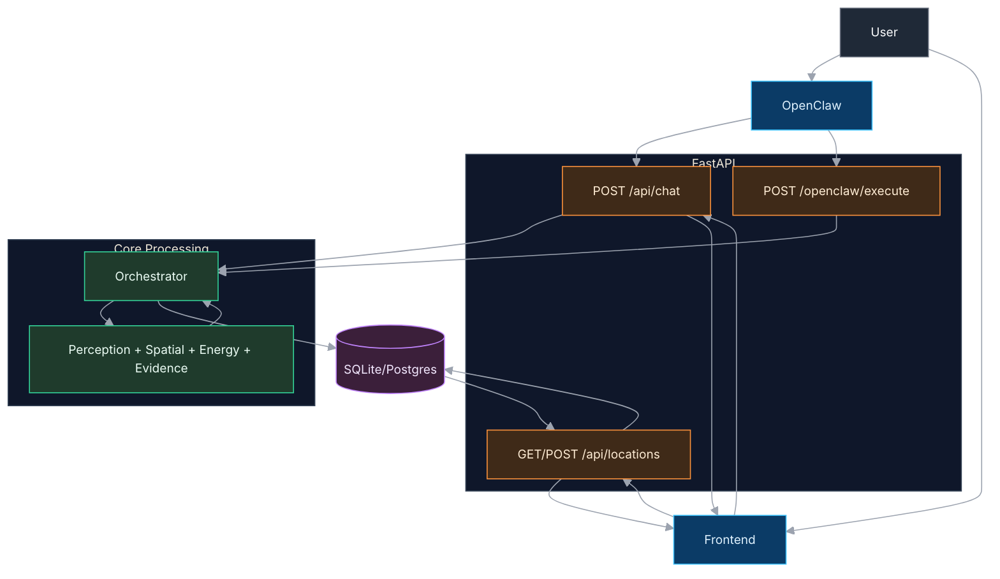

# Solaris System Architecture (Level 2)

## Compact Diagram

## Flow

- User sends request from OpenClaw or frontend.
- FastAPI routes to chat/execute/location endpoints.
- Orchestrator runs agent workflow and returns analysis.
- Data is stored in DB and shown in frontend.
