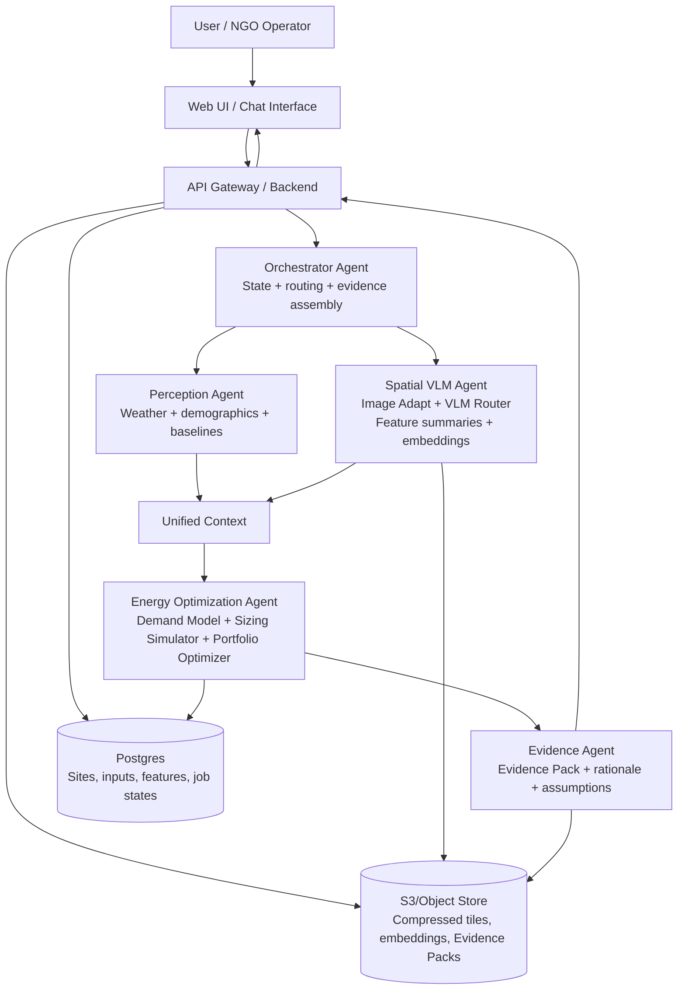

# Solaris Runtime Architecture (VLM-first, simplified)

## Overview
OpenClaw orchestrates a simplified multi-agent flow:
1. **Perception Agent** reads and analyzes weather + demographics + user inputs.
2. **Spatial VLM Agent** runs image adaptation + VLM routing/analysis.
3. **Energy Optimization Agent** performs demand modeling, sizing simulation, and portfolio optimization.
4. **Evidence Agent** packages outputs into an Evidence Pack for reporting and audit.

## Runtime Flow
- Orchestrator handles state, retries, and result assembly.
- Perception + Spatial VLM run as parallel analysis branches.
- Their unified context feeds a single optimization stage.
- Outputs and artifacts are persisted to storage.

## Mermaid

## Fallback policy
- If imagery/VLM is unavailable, Spatial VLM emits `fallback_used=true` with reduced confidence.
- Optimization still runs using Perception baseline data.
